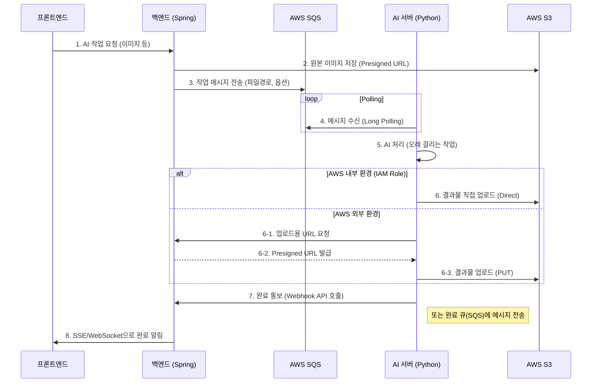

# AI 서버와 백엔드 연동 아키텍처 가이드

백엔드(Spring Boot)와 AI 서버(Python) 사이에 **SQS**를 두고 비동기 처리를 하면서, 결과물 파일을 **S3**에 업로드하는 최적의 아키텍처를 제안합니다.

## 1. 파일 업로드 방식에 대한 답변

결론부터 말씀드리면, **AI 서버가 S3에 직접 업로드**하는 것이 좋습니다.

### ✅ 추천 방식: AI 서버 → S3 직접 업로드
AI 서버가 생성한 결과물(이미지, 3D 모델 등)을 Spring 백엔드를 거치지 않고 바로 S3로 전송합니다.

*   **이유**:
    *   **성능**: 대용량 파일을 백엔드를 거쳐 보내면 백엔드 서버의 네트워크 대역폭과 메모리를 불필요하게 사용하게 됩니다.
    *   **확장성**: AI 서버가 늘어나도 백엔드에 부하를 주지 않습니다.

### ❌ 비추천 방식: AI 서버 → 백엔드 → S3
*   **단점**: 백엔드가 불필요한 중계 역할을 하여 병목 현상(Bottleneck)이 발생할 수 있습니다.

---

## 2. 보안 처리 방식 (Key 관리)

AI 서버가 S3에 업로드할 권한을 어떻게 획득하느냐는 **인프라 환경**에 따라 달라집니다.

### Case A: AI 서버가 AWS 내부(EC2, ECS, EKS 등)에 있는 경우 🌟 (Best)
*   **방법**: **IAM Role**을 사용합니다.
*   **설명**: AI 서버가 실행되는 EC2 인스턴스나 컨테이너에 "S3 Upload 권한이 있는 IAM Role"을 부여합니다.
*   **장점**: 코드에 Access Key/Secret Key를 박아넣거나 Spring에서 키를 받아올 필요가 전혀 없습니다. AWS가 알아서 인증을 처리하므로 보안상 가장 안전합니다.

### Case B: AI 서버가 AWS 외부(로컬 PC, 타 클라우드, 온프레미스)에 있는 경우
*   **방법 1: Presigned URL 사용** (Spring에게 요청)
    1.  AI 작업 완료 후, AI 서버가 Spring에게 "업로드할 파일이 있으니 URL 줘"라고 API 요청.
    2.  Spring은 `S3Presigner`를 이용해 **업로드용 Presigned URL**을 발급하여 AI 서버에 응답.
    3.  AI 서버는 그 URL로 파일을 `PUT` 요청.
    *   **장점**: AI 서버에 장기적인 키를 저장할 필요가 없어 안전합니다.
*   **방법 2: IAM User Key 사용** (최소 권한)
    *   AI 서버 설정 파일(.env)에 'S3 업로드 전용 IAM User'의 Access Key를 저장하여 사용.
    *   관리가 편하지만 키 유출 위험이 있으므로 권장하지 않습니다.

---

## 3. 전체 추천 프로세스 (SQS 포함)

가장 권장하는 **비동기 처리 + Direct Upload** 흐름입니다.

## 4. 필요한 작업
현재 `build.gradle`에 SQS 관련 라이브러리가 없습니다. 구현을 시작하려면 다음 작업이 필요합니다.

1.  **Backend**: `software.amazon.awssdk:sqs` 의존성 추가.
2.  **Backend**: SQS 메시지 전송(Producer) 로직 구현.
3.  **Infrastructure**: AWS SQS 큐 생성 (RequestQueue, ResponseQueue).
4.  **AI Server**: `boto3` 등을 이용한 SQS 폴링 및 S3 업로드 로직 구현.
