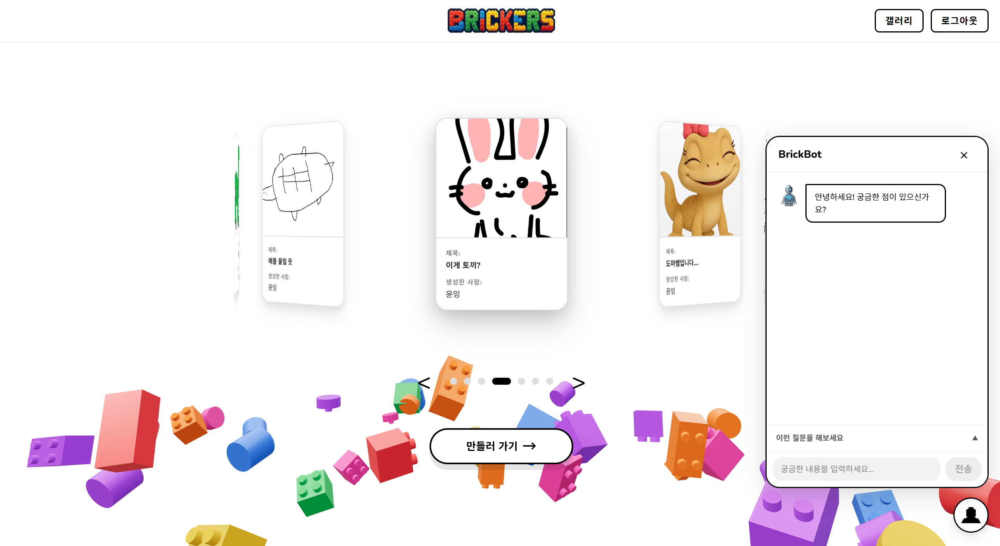
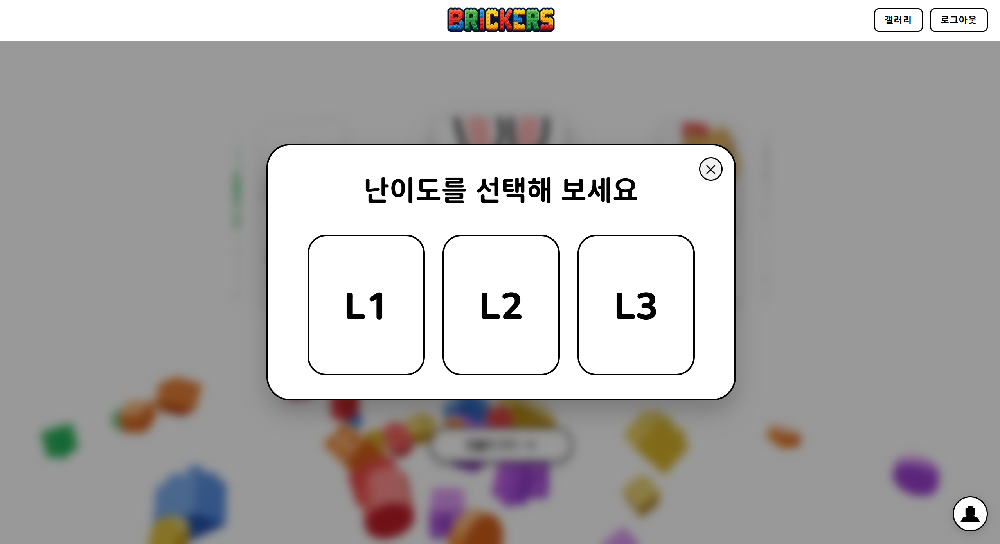
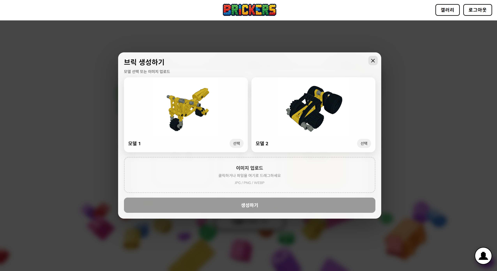
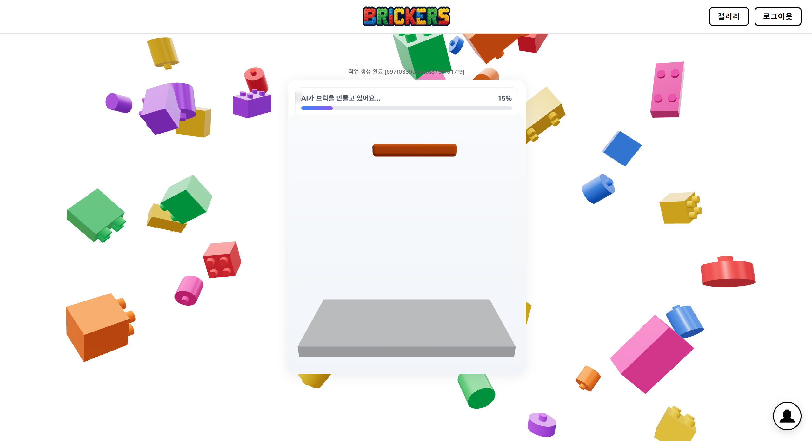
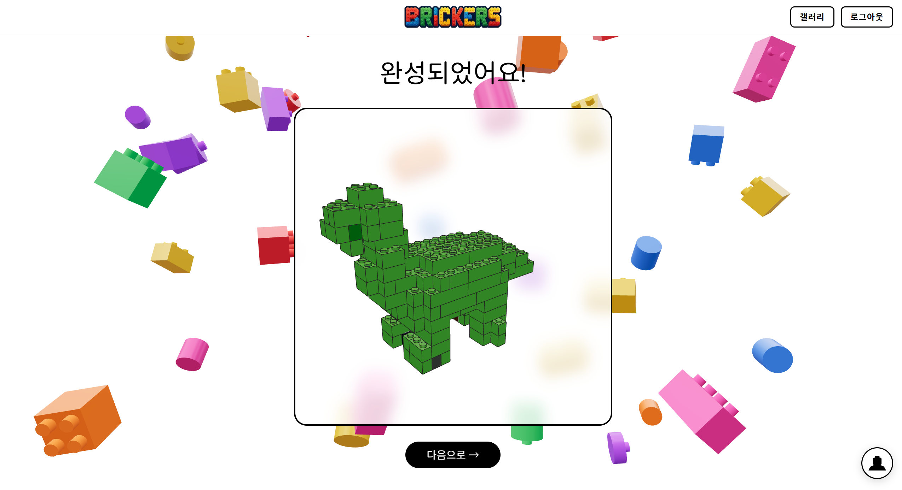
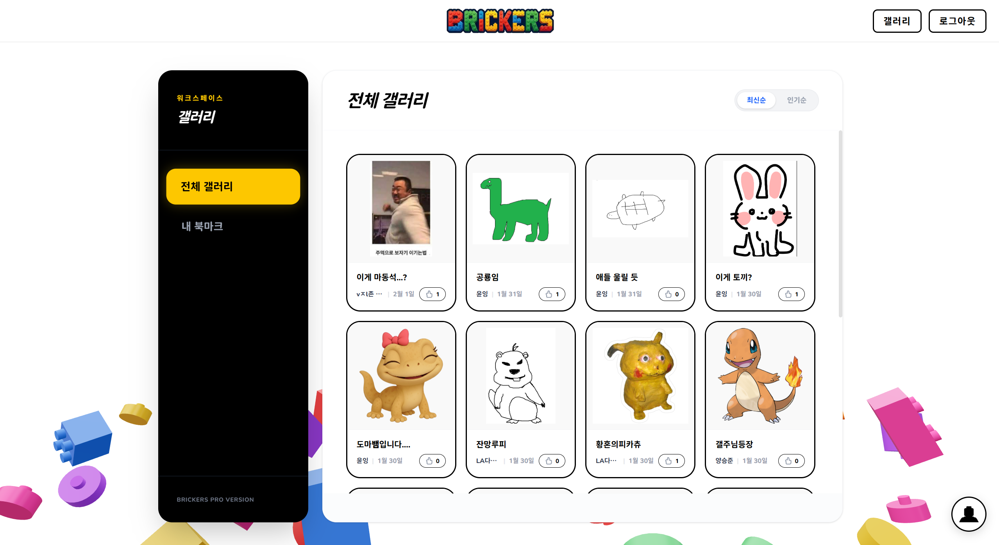
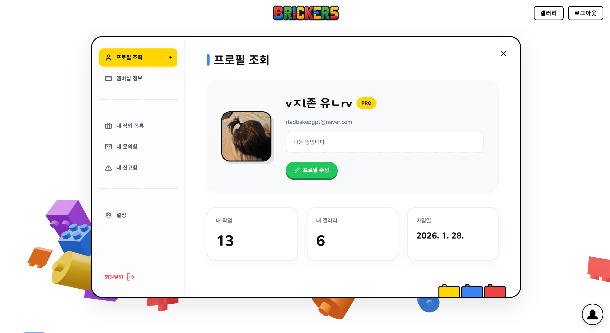
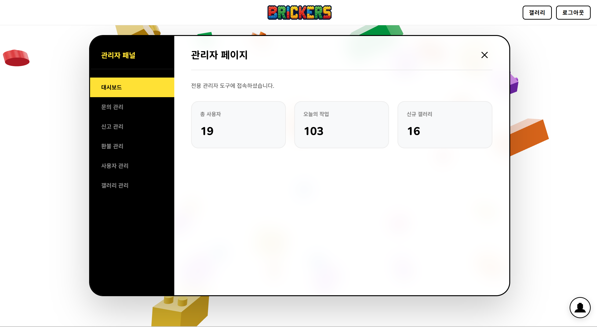

# Brick Generator

이미지나 3D 모델을 기반으로 최적화된 브릭 설계도와 조립 가이드를 생성하는 AI 플랫폼입니다. 사용자의 숙련도에 따라 **Level 1 ~ 3**까지 난이도를 조절할 수 있습니다.

---

## Key Features

### 1. Difficulty Levels (난이도 선택)
사용자의 숙련도와 목적에 따라 3단계의 난이도(Level 1~3)를 선택할 수 있습니다.
* **Level 1 (Easy)**: 적은 브릭 수로 형태를 단순화하여 누구나 쉽게 조립 가능.
* **Level 2 (Normal)**: 적절한 디테일과 브릭 수의 균형.
* **Level 3 (Hard)**: 더 많은 브릭을 사용하여 정교한 디테일 표현.

### 2. AI Modeling (지능형 모델링)
AI가 이미지를 분석하여 브릭 모델을 자동으로 생성합니다.
* **자동 생성**: 사진 촬영 또는 이미지 업로드 후 별도 설정 없이 즉시 모델링 진행.
* **최적화**: 선택한 Level에 맞춰 브릭 수와 디테일을 자동으로 조절.

### 3. AI BrickBot (Chatbot)

사용자를 돕는 AI 챗봇 가이드입니다.
* **가이드 제공**: 서비스 이용 방법 및 조립 팁 제공.
* **실시간 지원**: 궁금한 점을 언제든 물어볼 수 있는 대화형 인터페이스.

---

## User Flow

### [Step 1] 인증 및 진입
- 회원가입 및 로그인
- **난이도 선택** (난이도 및 예산에 따른 크기 조절)

### [Step 2] 소스 입력 및 분석
- 모바일 촬영 또는 이미지 갤러리 선택

### [Step 3] 생성 및 최적화
- 선택한 난이도에 맞춰 AI가 브릭 모델 생성 및 최적화

### [Step 4] 결과 수령
- 설계 완료(Finalize) 후 각 모드에 최적화된 형태의 데이터 다운로드

---

## Output Format

| 항목 | 내용 |
| :--- | :--- |
| **설계도** | 난이도별 최적화된 조립 설명서 (Web/PDF) |
| **데이터 파일** | LDR, 3D Model (GLB) |

---

## More Screenshots

### Gallery

### My Page

### Admin Page

